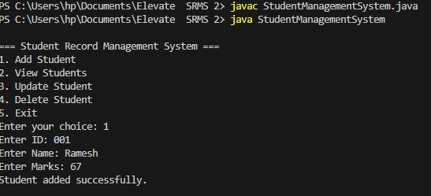
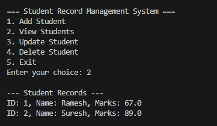
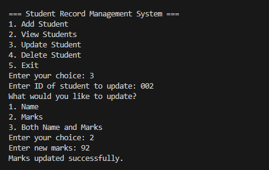
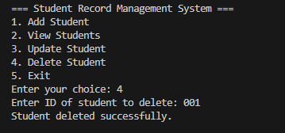
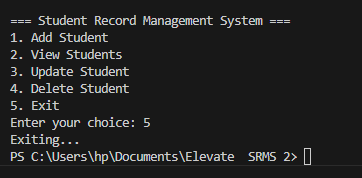

**Student Record Management System**

Overview:

The **Student Record Management System** is a Command Line Interface (CLI) application developed in Java that allows users to manage student records efficiently. This system provides functionalities to add, view, update, and delete student information using **object-oriented programming (OOP)** and **ArrayList** in Java, making it a practical tool for educational institutions or personal use.

**Features**

- Add students: Allows the user to add a new student record with an ID, name, and marks.

- View Students: Displays a list of all student records.

- Update Student: Enables the user to update the details of an existing student using their ID.

- Delete Student: Allows the user to delete a student record based on the student ID.

- User-Friendly Interface: The system provides a straightforward menu-driven interface for ease of use.

----

**Technologies Used**

1. Java -- The programming language used to develop the application.For java download [click here](https://www.oracle.com/java/technologies/downloads/).
2. VS Code or IntelliJ CE
3. Terminal/Command Prompt.
4. ArrayList(Collections) -- A dynamic array used to store student objects.

 Learn more about Java (`ArrayList`) on [W3schools](https://www.w3schools.com/java/java_arraylist.asp).

---

 **How code works(step-by-step)**

 This **Student Record Management System** uses Object-oriented programming in java to manage student records.
  
1. Scanner class - (`import java.util.Scanner`)Reads input from the user.

2. ArrayList -(`import java.util.ArrayList`) Used to store all student records dynamically.You can add, update, or delete students without worrying about size limits.

3. Student class-This class has three fields—`id`, `name`, and `marks`. It also includes a `display()` method to print student details.

4. do-while loop-The program runs inside a `do-while` loop, showing a menu until the user chooses to exit.

5. Switch statement-Based on the user's choice, the appropriate method is called:
  - `addStudent()` – Takes input and adds a new student.

  - `viewStudents()` – Displays all students using a loop.

  - `updateStudent()` – Finds a student by ID and updates their information.

  - `deleteStudent()` – Finds and removes a student from the list.

6. For loop-For updating or deleting, the program uses a simple `for` loop to search the `ArrayList` for a matching ID.
----
**How to run the program**

- Compile the program -(`javac StudentManagementSystem.java`).

- Run the program -(`java StudentManagementSystem`).

**Program Menu**

When you run the program it displays like this :

Each number corresponds to specific operation:
-  1.**Add student**-Asks the user to enter the student's ID, name, and marks. A new student object is created and added to the list.

- 2.**View students**-Displays all the student records currently stored.

- 3.**Update student**-Asks the user for the student ID and then provides options to update:
Only name,
Only marks,
Both name and marks.
- 4.**Delete student**- Asks the user for the student ID and removes the matching student record from the list, if found.
- 5.**Exit**-The menu keeps showing repeatedly until the user selects option `5` to exit the application.

---

**Output Screenshots**

                       Add student  

 

                        View students

                 

                        Update Student

                        Delete Student

                        Exit application

